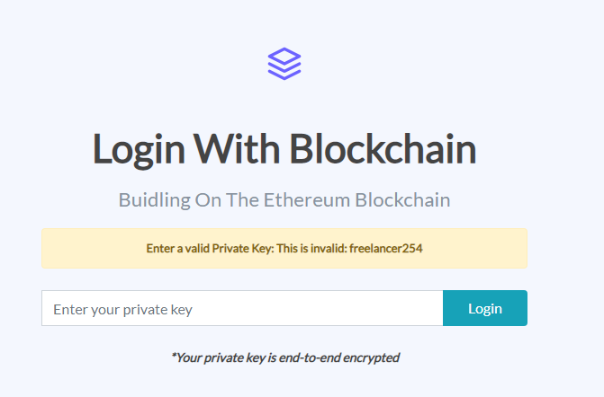
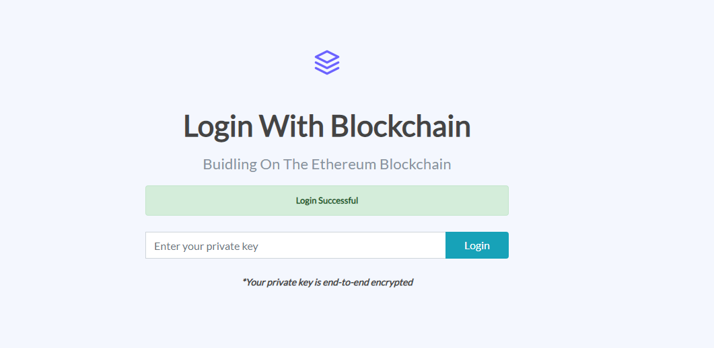
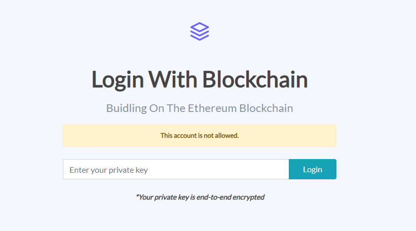

# Login With Blockchain

A proof of concept for aunthenticating via the Ethereum Blockchain. The user uses their private key which is end to end encrypted with RSA encryption. On the server side, the private key is decrypted, then the Ethereum account is retrieved. The next step is to retrieve the Ethereum address from the Ethereum account. The final step is to connect to the Ethereum blockchain and check if the account is allowed via a smart contract. There is no storage of the private key and only the Ethereum address is added in the Ethereum blockchain smart contract. 

## Getting Started
Prior knowledge in Python and Solidity is required for deeper understanding not necessary to run the project though.

### Prerequisites
To connect to the Ethereum Mainnet, you will need an https://www.infura.io RPC key
The project is written in Python and uses Django Web Framework and Web3.py (Python Implementation of Ethereum)

If you don't have Python installed, download here: https://www.python.org/ftp/python/3.8.3/python-3.8.3.exe
Use a virtual environment in the project directory.

Install virtualenv

```
pip install virtualenv
```

Create a virtual environment

```
virtualenv projectenv
```

Activate the virtual environment

Open a terminal in the project directory

```
cd projectenv

cd Scripts

activate
```


### Installing

Now you can proceed to install Django and Web3 in the Virtual environment (projectenv)

```
pip install django
pip install web3
```

Download the project

You can download the project zip file or clone with git.


## Running the project

Before running the project, edit views.py and enter your https://www.infura.io RPC Mainnet Key

```
line 35: infura_url = "ENTER YOUR INFURA RPC MAINNET KEY"
```

In the project directory (where manage.py is), while the virtual env is activated.

```
python manage.py runserver
```

### Viewing in the browser

The above command will start a local server in the port 8000 
In your web browser enter the link

```
http://127.0.0.1:8000
```

## Testing

There is a sample account with the private key : 28a867edadeb3dbaf175e8fca9042376ae846d6e79f520f2cdd1f15b4bd0d1df
The smart contract has already been deployed: The contract address and abi is also available
Use it for testing.

## Screenshots
On an invalid private key



On a valid allowed private key



On a valid not allowed private key



## Built With

* [Django](https://djangoproject.com/) - The web framework used
* [Web3.py](https://web3py.readthedocs.io/) - Python Ethereum Implementation


## Authors

* **Robert Mutua** - *Just a proof of concept* - [freelancer254](https://github.com/freelancer254)


## Acknowledgments

* web3.py for making Ethereum accessible to Python developers
* django 


